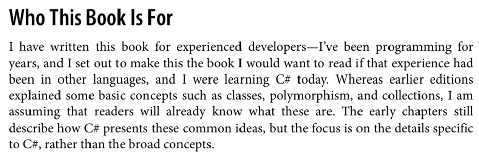

# چه مسئله و یا مشکلی را دیده‌اید و یا برای بهتر شدن چه قسمتی، پیشنهاد دارید؟

در داکیومنت‌های ورود به دوره ذکر شده که دوره پیش‌نیازی ندارد. برای دوره سی‌شارپ کتاب "Programming C# 12" معرفی شده است. در صفحه xvii کتاب ذکر شده که محتوای آن برای توسعه‌دهندگانی است که تجربه قبلی دارند.

من طی استپ‌های ۱ و ۲ محتوای فصل‌های ابتدایی کتاب را بررسی و با دو کتاب "C# In a Nutshell" و "C# 13 and .NET 9 – Modern Cross-Platform Development Fundamentals" مقایسه کردم. تجربه من این بود که محتوای "Programming C# 12" به شکلی است که برای فردی که اولین تجربه برخورد با سی‌شارپ را دارد، ممکن است گیج‌کننده باشد و حتی باعث شود انگیزه کافی برای ادامه مطالعه را نداشته باشد. هر دو کتاب "C# In a Nutshell" و "Programming C# 12" با اینکه عمیق و با محتوا هستند، اما به اندازه کافی practical نیستند و برای شروع برنامه‌نویسی توصیه نمی‌شوند.

علاوه بر این، بررسی‌های من نشان می‌دهد که "Programming C# 12" فرض می‌کند خواننده با مفاهیم برنامه‌نویسی آشنا است و بیشتر بر جزئیات فنی و تکنیک‌های پیشرفته تمرکز دارد، که می‌تواند برای مبتدیان خسته‌کننده باشد. این مسئله در تمام استپ‌های دوره (از استپ ۱ تا ۱۱) که به فصل‌های این کتاب ارجاع می‌دهند، تأثیرگذار است، زیرا استپ‌ها بر پایه مطالعه این کتاب ساخته شده‌اند و ممکن است منجر به نرخ ترک بالاتر در میان شرکت‌کنندگان تازه‌کار شود. مشکل از زوایای مختلفی بررسی می‌شود: از نظر آموزشی، کتاب فعلی ممکن است باعث سردرگمی در درک مفاهیم پایه مانند Types، Generics و Collections شود؛ از نظر انگیزشی، عدم وجود مثال‌های عملی کافی می‌تواند علاقه را کاهش دهد؛ و از نظر کارایی دوره، این می‌تواند زمان یادگیری را افزایش دهد یا نیاز به منابع جانبی ایجاد کند.

# از نظر شما، میزان حساسیت این مسئله چقدر است؟ (لطفاً عددی بین ۱ تا ۴ انتخاب کنید؛ ۱ = بالاترین حساسیت، ۴ = کم‌ترین حساسیت)

میزان حساسیت ۳

# پیشنهاد خود را ارائه دهید و توضیح دهید که چگونه این پیشنهاد به حل مسئله‌ای که مشاهده کرده‌اید کمک می‌کند.
پیشنهاد من تغییر کتاب مرجع در استپ‌ها و محتوای دوره از "Programming C# 12" به "C# 13 and .NET 9 – Modern Cross-Platform Development Fundamentals" است. این تغییر باید مرحله‌به‌مرحله انجام شود:

به‌روزرسانی لینک‌ها و ارجاعات به فصل‌ها در تمام استپ‌های roadmap (مانند استپ ۳: Generics، استپ ۴: Collections، و غیره) با فصل‌های معادل در کتاب جدید.
بررسی و تنظیم تمرین‌ها و پروژه‌های مینی (مانند پروژه Animal Hierarchy در استپ ۵ یا Task Management System در استپ ۴) برای همخوانی با مثال‌های کتاب جدید.
اطلاع‌رسانی به شرکت‌کنندگان فعلی و آینده از طریق تاپیک‌های کوردینیتور و داکیومنت‌های دوره.

این پیشنهاد به حل مسئله کمک می‌کند زیرا کتاب جدید با تمرکز بر مثال‌های عملی، تمرین‌های hands-on و معرفی گام‌به‌گام مفاهیم، یادگیری را برای مبتدیان آسان‌تر می‌کند. برای مثال، کتاب جدید شامل راهنمایی برای تنظیم محیط توسعه (مانند Visual Studio Code) و مثال‌های واقعی برای ساخت اپلیکیشن‌های ساده است، که مستقیماً به کاهش گیج‌کنندگی و افزایش انگیزه کمک می‌کند.

# پیشنهاد و ایده خود را بررسی کنید و بنویسید چه نقاط قوت و چه ریسک‌هایی دارد.

نقاط قوت:

کتاب جدید برای مبتدیان تا متوسط طراحی شده و شامل تمرین‌های عملی، کدهای قابل اجرا و تمرکز بر توسعه cross-platform است، که دوره را جذاب‌تر می‌کند.
بر اساس بررسی‌ها در Amazon و Reddit، کاربران مبتدی گزارش داده‌اند که این کتاب یادگیری را سریع‌تر و لذت‌بخش‌تر می‌کند، با امتیاز میانگین 4.5/5 در بیش از 90 بررسی.
پوشش ویژگی‌های جدید C# 13 و .NET 9، که دوره را به‌روز نگه می‌دارد و شرکت‌کنندگان را برای بازار کار آماده‌تر می‌کند.

ریسک‌ها:

برخی موضوعات پیشرفته در استپ‌های بالاتر (مانند Asynchronous Features در استپ ۱۰ یا LINQ در استپ ۹) ممکن است در کتاب جدید کمتر عمیق پوشش داده شوند، که نیاز به منابع مکمل ایجاد کند.
تغییر کتاب ممکن است باعث سردرگمی موقت برای شرکت‌کنندگان فعلی باشد، اگر انتقال به خوبی مدیریت نشود.
کتاب جدید ممکن است بر روی جنبه‌های web و cross-platform بیشتر تمرکز داشته باشد، در حالی که کتاب فعلی بیشتر بر fundamentals زبان تأکید دارد.

# توضیحات تکمیلی خود را بنویسید. (در صورت نیاز)

این مقایسه بر اساس بررسی‌های آنلاین (مانند Amazon reviews و Reddit threads) و پیشگفتار کتاب‌ها تهیه شده است. همچنین، با استفاده از ابزارهایی مانند Grok و Perplexity، نظرات کاربران در Reddit (e.g., r/csharp) و X (formerly Twitter) بررسی شد که اکثراً کتاب Price را برای مبتدیان ترجیح می‌دهند. اگر نیاز به تغییر در استپ‌های خاص باشد، می‌توانم پیشنهادهای دقیق‌تری ارائه دهم.

